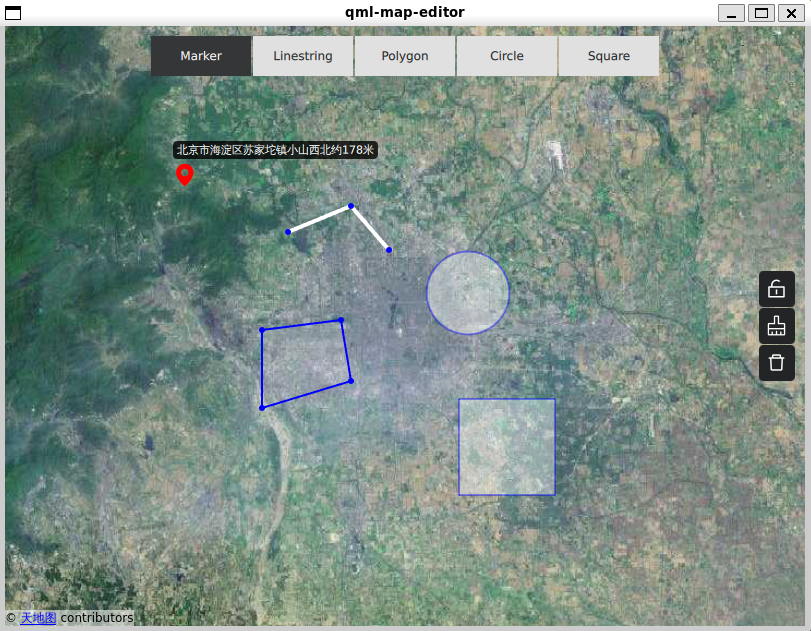

# QML Map Editor

[中文](README.md) | [English](README.en.md)

[](https://opensource.org/licenses/MIT)

A map editor based on Qt Quick and QtLocation, supporting drawing and editing various geometric shapes on maps.



## Features

- **Marker** - Add markers on the map with drag support and reverse geocoding for address display
- **LineString** - Draw polylines with multiple connected points, editable vertices
- **Polygon** - Draw closed polygon areas with editable vertices
- **Circle** - Draw circular areas with draggable edge to adjust radius
- **Square** - Draw square areas with draggable edge to adjust side length

## Editing Controls

- 🖱️ **Double-click left** - Add new geometry or vertex
- 🖱️ **Right-click** - Finish current editing (close shape)
- 🖱️ **Ctrl+click** - Multi-select geometries
- 🔒 **Lock mode** - Lock editing to prevent accidental changes
- 🗑️ **Delete** - Delete selected geometry or vertex
- 🧹 **Clear** - Clear all geometries

## Project Structure

```
qml-map-editor/
├── src/
│   ├── main.cc                    # Entry point
│   ├── App.qml                    # Main window
│   ├── EditorMap.qml              # Map component (with reverse geocoding)
│   ├── MapEditorLayer.qml         # Editing layer
│   ├── MapEditorToolBar.qml       # Edit mode toolbar
│   ├── MapEditorActionBar.qml     # Action toolbar
│   └── components/                # Component library
│       ├── mapeditorcontroller.*  # Editor controller
│       ├── mapgeometry.*          # Geometry base class
│       ├── mappoint.*             # Point
│       ├── maplinestring.*        # LineString
│       ├── mappolygon.*           # Polygon
│       ├── mapcircle.*            # Circle
│       ├── mapsquare.*            # Square
│       └── Map*Item.qml           # Corresponding QML visual components
├── assets/                        # Icon resources
├── cmake/                         # CMake modules
└── CMakeLists.txt                 # Project configuration
```

## License

This project is licensed under the [MIT License](LICENSE.md).
